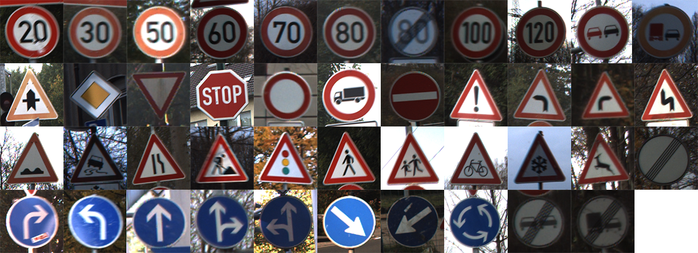
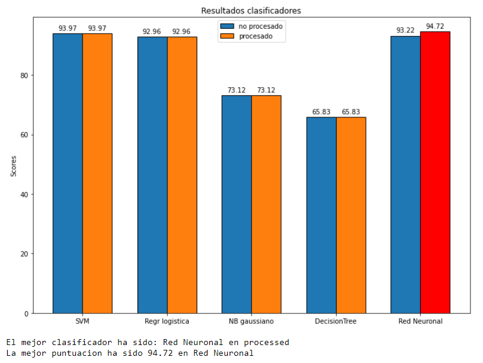
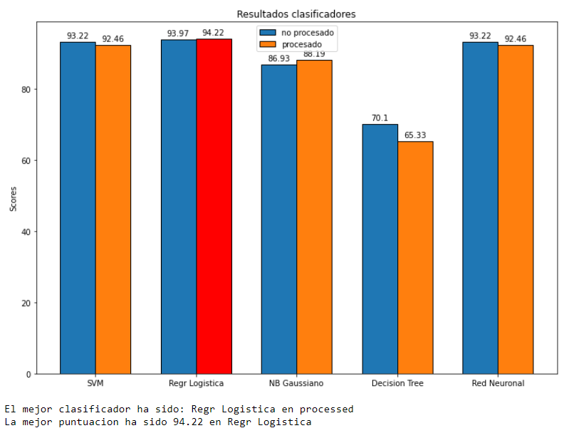
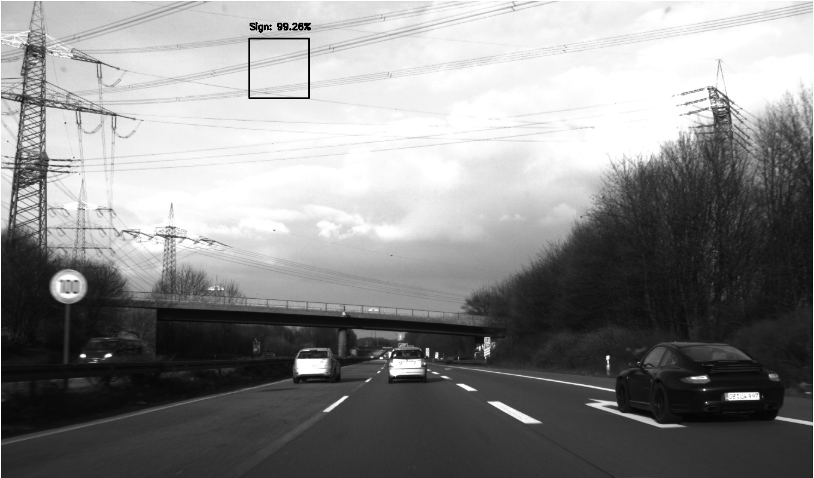
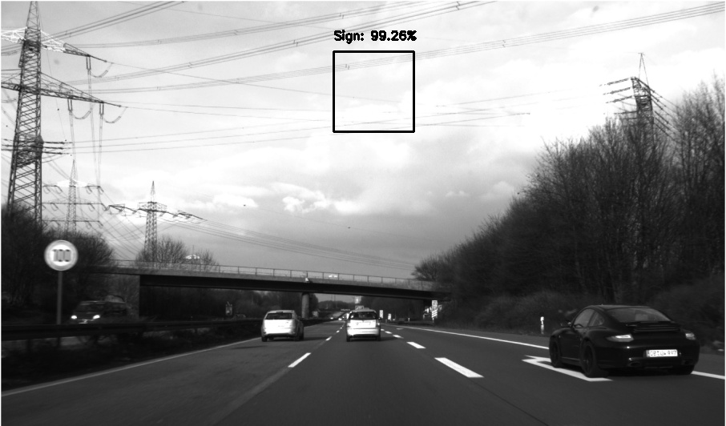
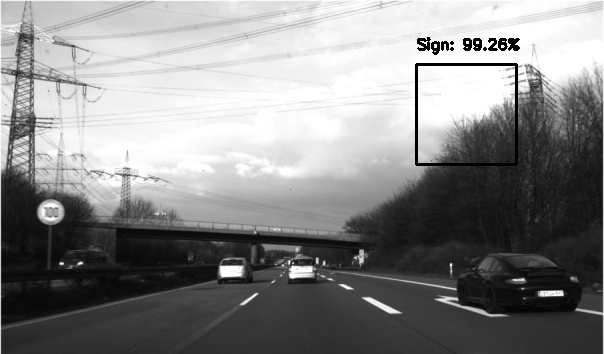
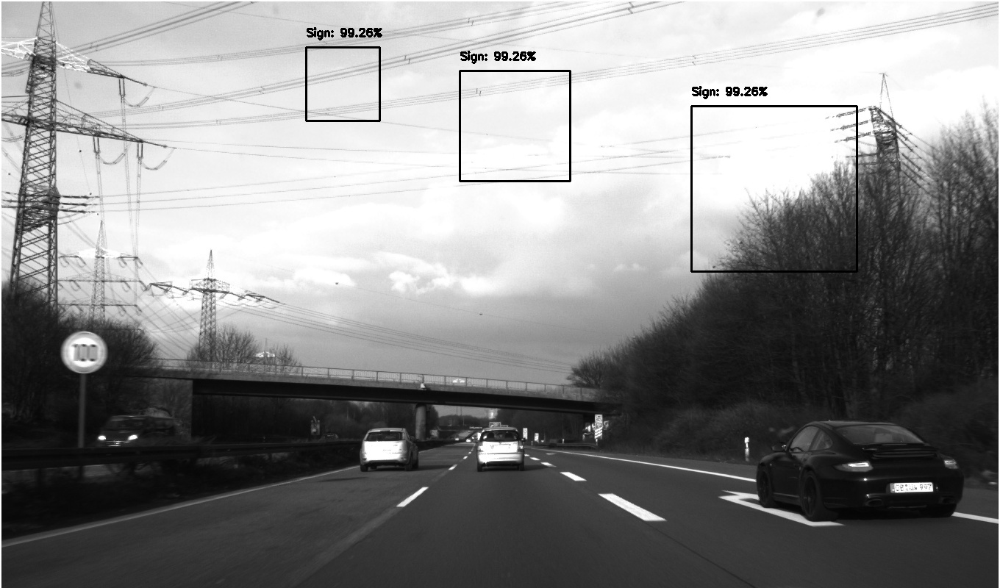
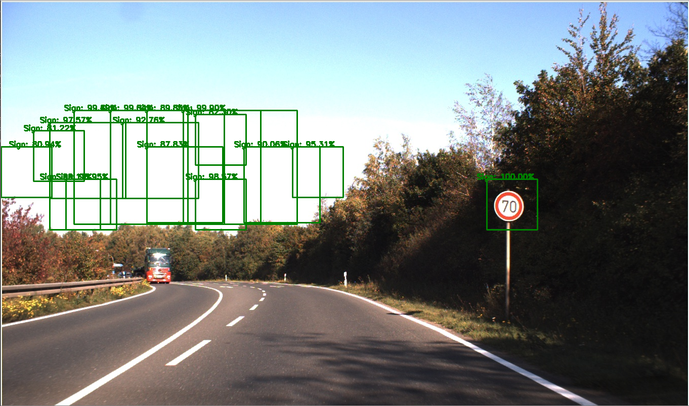
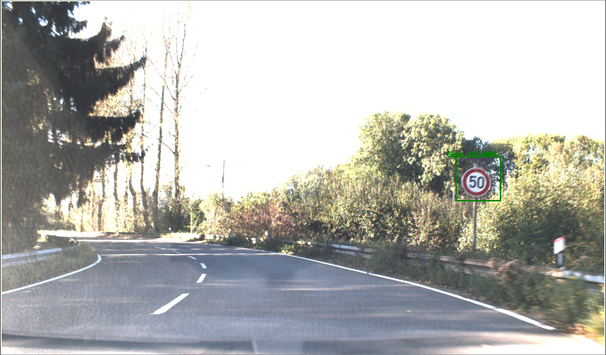

# Traffic sign detector and classifier

En este proyecto vamos a elaborar mediante lo aprendido en Vision Artificial y Aprendizaje Formal un programa que sea capaz de detectar y clasificar 43 tipos de señales de tráfico diferentes.

Las señales que soporta el clasificador son las siguientes:



## Estrategia clasificación:

En la carpeta [csvs](csvs/) podemos encontrar 43 csvs que contienen los datos de las imagenes de [Dataset_traffic_sign](Dataset_traffic_sign/) procesadas por el algoritmo HOG de opencv. Mas informacion [aqui](https://www.learnopencv.com/histogram-of-oriented-gradients/)

Utilizamos este algoritmo para crear los datos de cada clase y posteriormente crear otros 2 conjuntos de datos [train](train_img_features.npy) y [test](test_img_features.npy) para entrenar y probar clasificadores.

Para clasificar las señales usaremos:
- SVMs
- Naive Bayes
- Regresion logistica multiclase
- Decision tree
- Red Neuronal (MLPClassifier)

Todos ellos de las librerias de [sklearn](https://scikit-learn.org/stable/)
### HISTOGRAM ORIENTED GRADIENT (HOG)

El algoritmo HOG es un metodo de extraccion de caracteristicas que nos permite transformar los pixeles por gradientes que nos indican hacia donde se orientan los cambios de intensidad de dichos pixeles. Esto es muy util porque nos permite obtener caracteristicas muy representativas de una imagen y que nos serviran para comparar con otras similares, ya sean caras, señales de tráfico, etc...

Hemos definido un conjunto de clasificadores y entrenarlos para quedarnos con el mejor resultado:
```
classifiers = [ SVC(),
                LogisticRegression(random_state=0,max_iter=400),
                GaussianNB(),
                DecisionTreeClassifier(),
                MLPClassifier()]

clf_names = ['SVM', 'Regr Logistica', 'NB Gaussiano','Decision Tree','Red Neuronal']
```
Para ello tambien hemos usado GridSearchCV para obtener el mejor ajuste de los paremtros de los clasificadores

```
parameters_dict = {'SVM':{'kernel':('linear', 'rbf'), 'C':[1, 10],'gamma':[0.1,0.001]},
                   'Regr Logistica':{'C': [0.01, 1, 10, 1000] },
                   'NB Gaussiano':{'var_smoothing': np.logspace(0,-9, num=10)},
                   'Decision Tree':{'min_samples_split': [2, 3, 4],
                                     'criterion': ['gini', 'entropy']},
                   'Red Neuronal':{'activation': ['tanh', 'relu'],
                                    'solver': ['sgd', 'adam']}
                  }
```
Importante resaltar tambien el parametro cv que hemos tenido que ajustar 'cv = 2' ya que para determinadas clases no habia suficientes ejemplos y no se podía realizar la validación cruzada y el parametro n_jobs que hace trabajar al procesador en paralelo para poder entrenar mas rápido.
```
clf = GridSearchCV(clf,parameters_dict[clf_name],cv = 2,n_jobs=-1)
```

Estos han sido los resultados tanto de precision como de tiempo de entrenamiento de los clasificadores




Hemos tomado mejor clasificador finalmente Regresión Logistica ya que hemos obtenido una precisión del 94.2% y tiene un tiempo de entrenamiento razonable. Estos han sido los parametros utilizados
```

```
Lo guardamos en nuestro repositorio usando [pickle](https://docs.python.org/3/library/pickle.html) de este esta manera tenemos el objeto estimador guardado en disco sin necesidad de tener que volver a crear los datasets,entrenar y calcular el mejor.
```

```
## Estrategia deteccion:

A partir de las imagenes en [dataset_images](dataset/images) hemos creado otro dataset: [dataset_cropped_images](dataset/images) con imagenes de tamaño 100x100 para entrenar otro clasificador que nos determine si dicha imagen es o no una señal

Posteriormente con el clasificador ya entrenado vamos a aplicar un algoritmo de ventana deslizante junto a una piramide gaussiana. Usaremos las imagenes completas de [dataset_images](dataset/images). 

De primeras entrenamos una SVM que nos ofrecia bastantes buenos resultados y nos detectaba las señales con precisión pero nos dimos cuenta de que nos podía detectar una misma señal multiples veces al aplicar la ventana deslizante. Por ello decidimos aplicar Non-Maximum Supression para eliminar las detecciones multiples, para ello cambiamos el modelo de detección por un clasificador probabilístico que nos permitiera quedarnos con las ventanas con mayor probabilidad de su clase señal. Finalmente nos hemos quedado con un clasificador multinomial Naive Bayes de Sklearn.

## Pirámide gaussiana + ventana deslizante

Debido a la necesidad de barrer toda la imagen en busca de señales hemos hecho uso de una función de ventana deslizante, que dada una imagen va moviendo una ventana de tamaño 100x100 por la imagen.

Ahora bien, un problema que surge es que haya en la foto una señal tan grande como para que no sea detectada con esas dimensiones de ventana. La idea que primero viene a mente es aumentar el tamaño de la ventana, haciendo un barrido a toda la imagen con estas variaciones. 
Sin embargo, por las complicaciones que supondría la diferencia de tamaños de la ventana con respecto a las imágenes usadas en el entrenamiento, hemos decidido recurrir a una pirámide gaussiana.

Este método consiste en dada una foto, hacer una reducción de ésta, con un factor de reducción y hacer un barrido a cada una de estas producciones con el mismo tamaño de ventana, de forma que una señal que en la imagen anterior (más grande) fuera demasiado grande, en esta quepa.

Con esto obtenemos solapamiento de ventanas en algunas predicciones, que solucionamos con el Non-Maximum Supression mencionado anteriormente y que explicaremos más adelante.

Para poder mostrar la ventana que ha detectado un positivo en la imagen de tamaño original, hacemos uso de una lista en la que guardamos las ventanas con 4 valores para depsués, tras procesar toda la imagen, aplicar NMS (Non-Maximum Supression) y poder mostrarlas.
Estas 4 características son: el pixel inicial en ambos ejes en proporción al tamaño de la imagen en la que se ha detectado, el tamaño de la ventana (100) en proporción al tamaño de la imagen en la que se ha detectado y la confianza de la predicción.
Estas proporciones nos sirven para que luego, podamos mostrar las ventanas en la imagen original abarcando lo mismo que en la reducida, simplemente multiplicando este factor de relación por el tamaño de la imagen original.

Podemos apreciar esto en las siguientes imágenes...






Conseguimos mostrar las ventanas en su proporción original con la imagen.


## Non-Maximum Supression

Al obtener varias ventanas solapadas entre sí debemos quedarnos con una, para ello, primero, tenemos que elegir la que mayor nivel de confianza (probabilidad) nos de. 
Para cada ventana que haya, calculamos su IOU con respecto a esta ventana de mayor confianza, que es Intersection Over Union.


Es decir, la proporción intersección/union de ambas ventanas.
Con un threshold establecido, debemos eliminar todas las ventanas que tengan un IOU superior al threshold.
Así eliminamos las ventanas que contengan la misma detección y mantenemos las que contengan otro objeto distinto.

## Detección y clasificación 

Una vez tenemos un modelo que nos clasifique los distintos tipos de señales y hemos diseñado un algoritmo que sea capaz de detectar en una imagen donde se encuentra una señal, entonces podemos comenzar a utilizarlo en imágenes completas.

Le pasamos una imagen del conjunto que se nos ha otorgado y obtenemos lo siguiente...



Detecta la señal pero también detecta como señales algunos trozos de cielo y, además, solapadas, para eso necesitamos usar Non-Maximum Supression.

¿Cómo evitar falsos positivos con el cielo? Cogemos esos supuestos aciertos y calculamos la intensidad media de todas estas imágenes (todas de 100x100) y ponemos como umbral este valor para filtrar. Al procesar cada ventana si la intensidad media es mayor o igual a este umbral, se omite.

Tras aplicar estos cambios, obtenemos mejores resultados:



Con el filtro ya descartamos todo el cielo que a veces clasificaba como positivo, y obtenemos solo la clasificación de la señal.